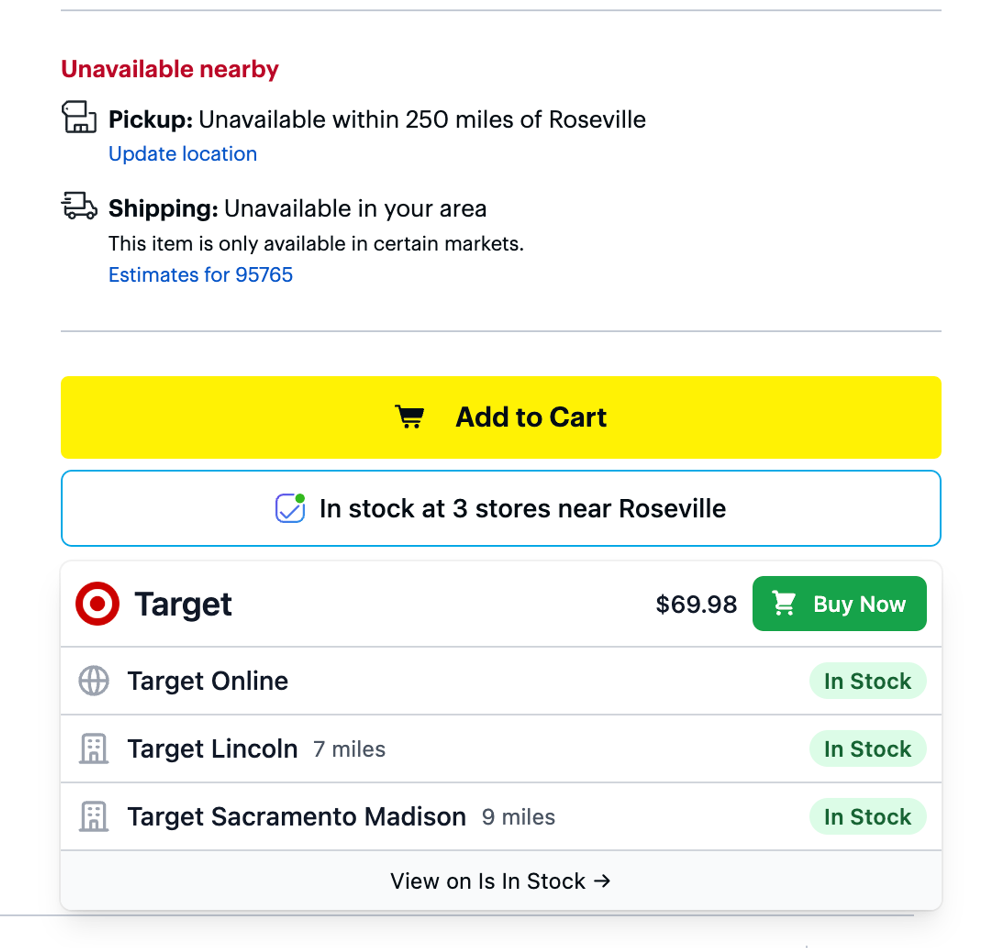
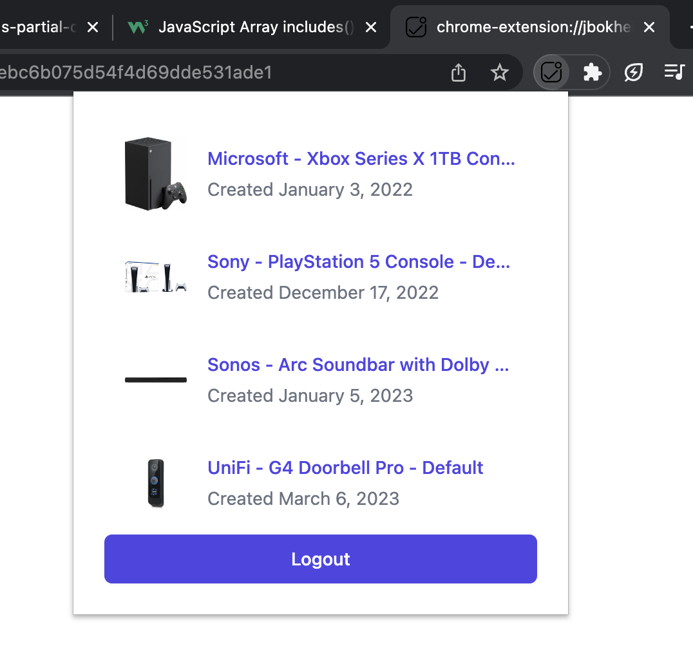

## Setup

- Open project in Dev Container
- Run `cmd+shift+b` to build the project in development mode.
- Load extension to Google Chrome by visiting `chrome://extensions`
- Enable Developer mode in the top right of your window
- Click Load unpacked in the top left of your window
- Locate and select the `dist` directory containing the built extension
- After making changes locally, you'll need to reload the extension in the Google Chrome extensions page

### Using production

To hit `https://www.isinstock.com` while in development, run:

```sh
npm run watch -- --production
```

### `<IsInStockButton />`



[`<IsInStockButton />`](./src/elements/isinstock-button.tsx) is the main entry point, handles logged out view, a sku being found, or a sku not being found.

The styles are in [`./src/elements/isinstock-button/style.css`](./src/elements/isinstock-button/style.css).

### Logged in page



To see active alerts the extension popup, click the extension icon in the top right of your browser. To edit the file that renders this page, see [`./src/pages/action-popup.tsx`](./src/pages/action-popup.tsx).

## Standard Support

- ✅ JSON-LD
- ❌ RDFa (Coming Soon)
- ❌ Microdata (Coming Soon)

## Retailer support

| Retailer | JSON-LD | RDFa | Microdata |
| -------- | ------- | ---- | --------- |
| Best Buy | ✅      |      |           |
| Target   | ✅      |      |           |
| Ubiquiti |         |      | ✅        |
